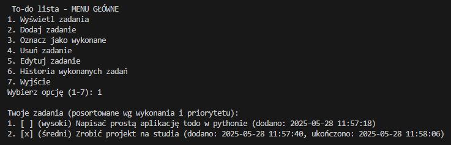

# To-do lista w Pythonie

To jest prosty program terminalowy do zarządzania listą zadań (To-do)

---

## Funkcjonalności

- Dodawanie nowych zadań z priorytetem (niski, średni, wysoki)  
- Oznaczanie zadań jako wykonane  
- Edytowanie i usuwanie zadań  
- Zapisywanie zadań i historii wykonanych zadań do plików JSON  
- Sortowanie zadań według statusu i priorytetu  
- Prosty interfejs tekstowy w terminalu  

---

## Przykładowe działanie 

*Wyświetlenie zadań*

  

*Edycja zadania*

  

*Wyświetlenie historii zadań*

  

---

## Jak uruchomić?

1. Upewnij się, że masz zainstalowanego Pythona w wersji 3.6 lub wyższej  
2. Sklonuj repozytorium lub pobierz pliki projektu  
3. W terminalu przejdź do folderu z projektem  
4. Uruchom program komendą:  
   ```bash
   python main.py
